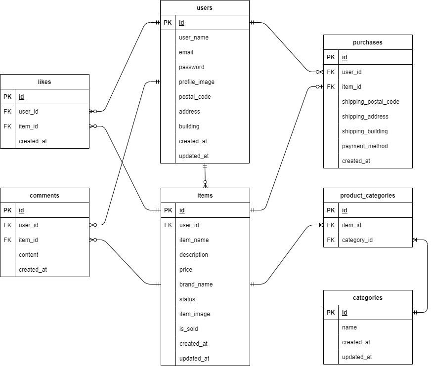

# フリマアプリ

## 環境構築
### Dockerビルド
1. git clone リンク
2. docker-compose up -d --build

＊ MySQLは、OSによって起動しない場合があるのでそれぞれのPCに合わせてdocker-compose.ymlファイルを編集してください。

### Laravel環境構築
1. docker-compose exec php bash
2. composer install
3. .env.exampleファイルから.envを作成し、環境変数を構築
4. php artisan key:generate
5. フリマアプリの会員登録画面で任意のユーザを追加(http://localhost/register)
6. php artisan migrate
7. php artisan db:seed(ユーザを追加しないとuser_idが存在しないエラーになります)

## 使用技術
- PHP 8.2.0
- Laravel 9.52.18
- MySQL 8.0.26

## ER図

## URL
- 開発環境：http://localhost/
- phpMyAdmin：http://localhost:8080/
