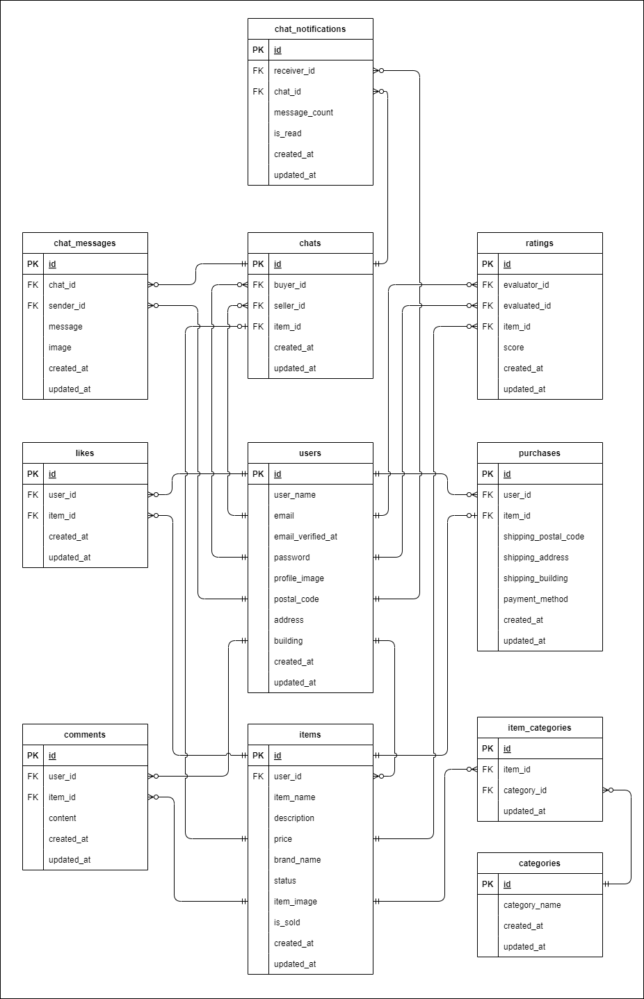

# フリマアプリ

## 環境構築
### Dockerビルド
1. git clone リンク
2. docker-compose up -d --build

＊ MySQLは、OSによって起動しない場合があるのでそれぞれのPCに合わせてdocker-compose.ymlファイルを編集してください。

### Laravel環境構築
1. docker-compose exec php bash
2. composer install
3. .env.exampleファイルから.envを作成し、環境変数を構築（MAILは以下のように修正）
````
MAIL_HOST=mail
MAIL_FROM_ADDRESS=info@example.com
````
4. php artisan key:generate
5. php artisan migrate
6. php artisan db:seed
7. php artisan storage:link

## ダミーデータ
### C001～C005の商品データを出品したユーザ
- メールアドレス；mercari@coachtech.com
- パスワード：password
### C006～C010の商品データを出品したユーザ
- メールアドレス；amazon@coachtech.com
- パスワード：password
### C001～C005の商品データを出品したユーザ
- メールアドレス；rakuten@coachtech.com
- パスワード：password

## 使用技術
- PHP 8.2.0
- Laravel 9.52.18
- MySQL 8.0.26

## ER図


## URL
- 開発環境：http://localhost/
- phpMyAdmin：http://localhost:8080/
- MailHog：http://localhost:8025/
